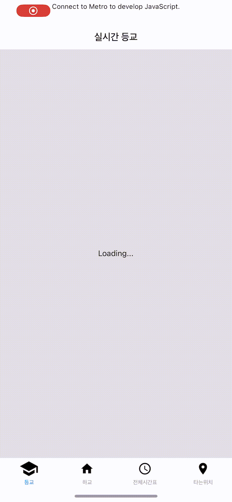
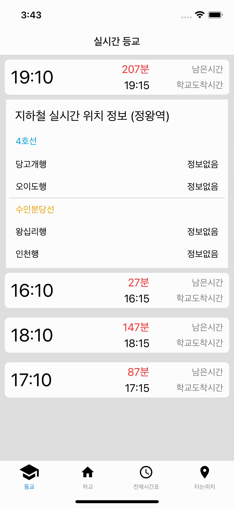
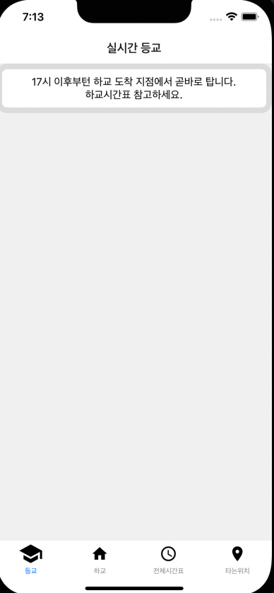
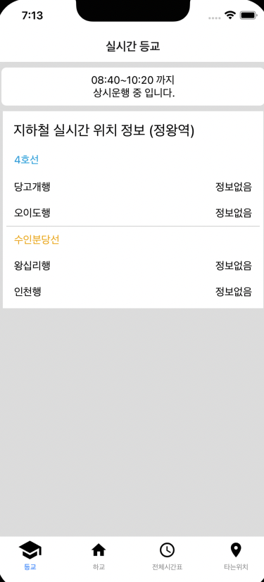

# TUK BUS Application
TUK BUS Application with React-Native
## Technology Stack
- 
- 
- 
- 
- 
- [Axios](https://github.com/axios/axios)
- [webview](https://github.com/react-native-webview/react-native-webview)

## API
- [카카오네비 미래 운행 정보 길찾기](https://developers.kakaomobility.com/docs/navi-api/future/)
- [카카오맵 지도 생성](https://apis.map.kakao.com/web/sample/basicMap/)

## Library
- [react navigation](https://reactnavigation.org)
- [react-native-page](https://callstack.github.io/react-native-paper/2.0/index.html)
- [react-native-vector-icons](https://github.com/oblador/react-native-vector-icons)
- [moment.js](https://momentjs.com/)

## What it looks like
### 등/하교

[카카오네비 미래 운행 정보 길찾기](https://developers.kakaomobility.com/docs/navi-api/future/) 을 이용해 도착예정시간을 받아오고, 서버에서 지하철 실시간 위치 정보를 받아와 표시한다.

### 전체시간표

### 타는 위치

[webview](https://github.com/react-native-webview/react-native-webview) 를 활용해 [카카오맵 지도 생성](https://apis.map.kakao.com/web/sample/basicMap/)을 해 타는 위치를 표시한다.

### 17시 이후 등교

### 상시운행
